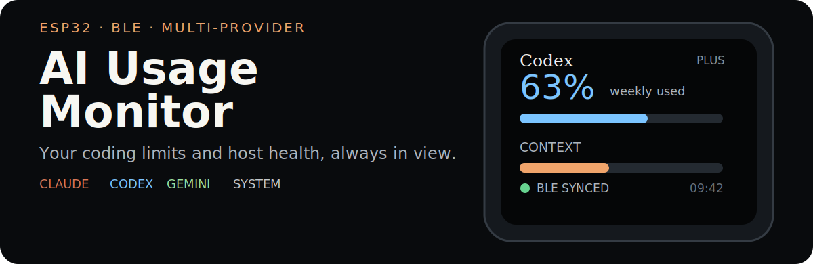
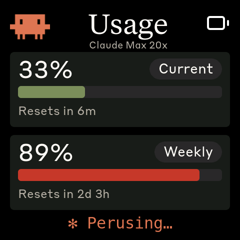
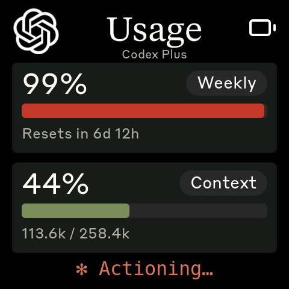
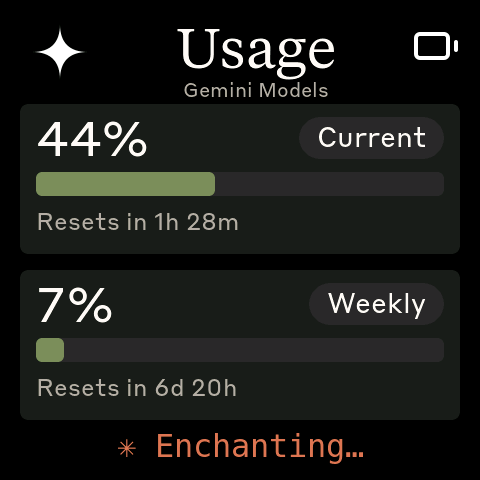
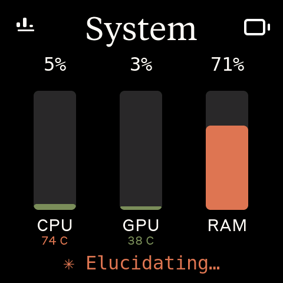
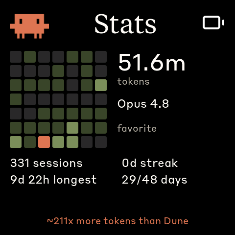

<p align="center">
  
</p>

AI Usage Monitor turns a small ESP32 AMOLED board into an always-on dashboard for **Claude Code, OpenAI Codex, Antigravity/Gemini, and host CPU/GPU/RAM**. A Linux, macOS, or Windows daemon polls the tools already on your computer, then sends a compact status payload over Bluetooth LE.

> [!IMPORTANT]
> This is a multi-provider fork of [HermannBjorgvin/Clawdmeter](https://github.com/HermannBjorgvin/Clawdmeter). It adds provider tabs, per-provider stats, and host-resource monitoring. The original firmware, HAL, splash engine, and BLE daemon are credited in [`NOTICE.md`](NOTICE.md).

## The dashboard

| Claude | Codex | Antigravity |
| :---: | :---: | :---: |
|  |  |  |

| System | Stats | Splash |
| :---: | :---: | :---: |
|  |  |  |

Swipe between available providers and System. Tap a provider title for its activity heatmap, token total, favourite model, sessions, and streaks. Providers that are not installed or logged in are omitted cleanly.

```text
System  ↔  Claude  ↔  Codex  ↔  Antigravity
              │          │           │
              └──── tap title ────────┘
                         ↓
                       Stats
```

The pixel-art Clawd splash animations come from [claudepix](https://claudepix.vercel.app), created by [@amaanbuilds](https://x.com/amaanbuilds). Their activity changes with your usage rate.

## Supported hardware

- Waveshare ESP32-S3-Touch-AMOLED-2.16
- Waveshare ESP32-C6-Touch-AMOLED-2.16
- Waveshare ESP32-S3-Touch-AMOLED-1.8
- Waveshare ESP32-C6-Touch-AMOLED-1.8

Board support is isolated behind a hardware abstraction layer. To add another board, follow [`docs/porting/adding-a-board.md`](docs/porting/adding-a-board.md) and the [`HAL contract`](docs/porting/hal-contract.md).

## Install

You need [PlatformIO CLI](https://docs.platformio.org/en/latest/core/installation/index.html), a supported board, Bluetooth, and Claude Code with an active login. Codex and Antigravity are optional; each appears only when detected.

### macOS

```bash
./flash-mac.sh waveshare_amoled_216
./install-mac.sh
```

Pair **Clawdmeter** in System Settings → Bluetooth before the daemon’s first sync. The installer creates a Python environment and a per-user LaunchAgent.

### Linux

```bash
./flash.sh waveshare_amoled_216
bluetoothctl scan le
bluetoothctl pair YOUR_DEVICE_MAC
bluetoothctl trust YOUR_DEVICE_MAC
./install.sh
systemctl --user start claude-usage-daemon
```

### Windows

Run this from native Windows PowerShell, not WSL:

```powershell
pio run -d firmware -e waveshare_amoled_216 -t upload --upload-port COM5
powershell -ExecutionPolicy Bypass -File install-windows.ps1
```

Then pair **Clawdmeter** in Settings → Bluetooth & devices. The installer creates a Python environment, installs the tray app, and adds per-user login startup.

To clear a saved bond and re-enter pairing mode on any platform, hold the middle power button for three seconds, then release.

## How data moves

```text
Claude headers ─┐
Codex endpoint ─┼─ host daemon ─ BLE GATT JSON ─ ESP32 firmware ─ LVGL display
Gemini LSP ─────┤
system stats ───┘
```

- **Claude** usage comes from rate-limit response headers after a minimal authenticated request.
- **Codex** usage comes from the endpoint used by the CLI; current context comes from the newest local rollout file.
- **Antigravity** quota comes from its local language server and retains the last good response while the CLI is closed.
- **System** values are refreshed from the host each polling cycle.
- **Stats** are derived from each provider’s local session data and sent separately to stay within the BLE payload limit.

The firmware also exposes a BLE HID keyboard. The left button sends Space, the right button sends Shift+Tab, and the middle button changes splash animations or brightness.

<details>
<summary><strong>BLE service and payload reference</strong></summary>

| Interface | UUID |
| --- | --- |
| Data Service | `4c41555a-4465-7669-6365-000000000001` |
| RX characteristic | `4c41555a-4465-7669-6365-000000000002` |
| TX characteristic | `4c41555a-4465-7669-6365-000000000003` |
| HID Service | `00001812-0000-1000-8000-00805f9b34fb` |

Provider keys are optional, so a missing CLI simply disappears from the device. Stats use a separate payload because the full dashboard plus heatmap data would exceed the 512-byte RX buffer.

</details>

## Development

```bash
pio run -d firmware
pytest daemon/tests
```

Porting documentation lives in [`docs/porting/`](docs/porting/), while sprite and icon conversion utilities live in [`tools/`](tools/).

## Credits and licensing

Clawdmeter was created by [Hermann Björgvin](https://github.com/HermannBjorgvin/Clawdmeter). The UI also contains Clawd art, provider marks, and proprietary brand fonts included for personal use. The repository therefore does not declare a copyleft license; read [`NOTICE.md`](NOTICE.md) before copying, redistributing, or shipping a derivative.
